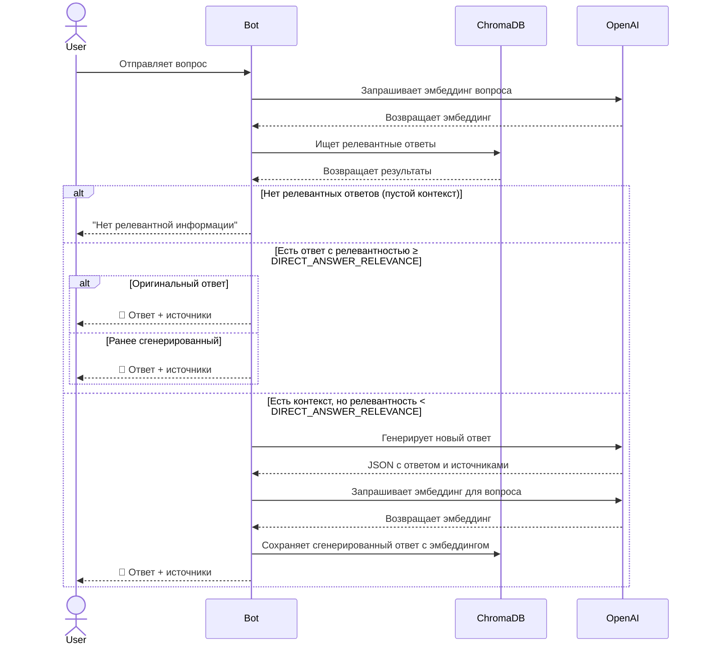

```mermaid
sequenceDiagram
    actor User
    participant Bot
    participant ChromaDB
    participant OpenAI

    User->>Bot: Отправляет вопрос
    #Note over Bot: Логирует вопрос пользователя
    Bot->>OpenAI: Запрашивает эмбеддинг вопроса
    OpenAI-->>Bot: Возвращает эмбеддинг
    Bot->>ChromaDB: Ищет релевантные ответы
    ChromaDB-->>Bot: Возвращает результаты

    alt Нет релевантных ответов (пустой контекст)
        Bot-->>User: "Нет релевантной информации"
    else Есть ответ с релевантностью ≥ DIRECT_ANSWER_RELEVANCE
        alt Оригинальный ответ
            Bot-->>User: 📖 Ответ + источники
        else Ранее сгенерированный
            Bot-->>User: 🚀 Ответ + источники
        end
    else Есть контекст, но релевантность < DIRECT_ANSWER_RELEVANCE
        Bot->>OpenAI: Генерирует новый ответ
        OpenAI-->>Bot: JSON с ответом и источниками
        Bot->>OpenAI: Запрашивает эмбеддинг для вопроса
        OpenAI-->>Bot: Возвращает эмбеддинг
        Bot->>ChromaDB: Сохраняет сгенерированный ответ с эмбеддингом
        Bot-->>User: 🧠 Ответ + источники
    end
``` 